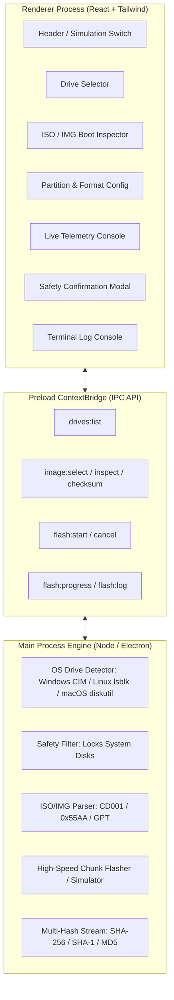

# ⚡ USB Writer

> **Universal, high-speed bootable ISO/IMG USB writer for Windows, macOS, and Linux — with Rufus-grade partition control & non-destructive simulation.**

[](https://github.com/RitualDev-Lab/usb-writer/actions)
[](https://opensource.org/licenses/MIT)
[](https://electronjs.org/)
[](https://react.dev/)
[](https://tailwindcss.com/)

---

## 🚀 Key Features

* **⚡ Ultra-High Speed Flashing Engine:**
  * 4MB chunked streaming I/O pipeline with real-time speed monitoring ($MB/s$) and accurate dynamic ETA calculation.
* **🛡️ Dual-Layer OS Disk Safety Guard:**
  * Auto-detects and permanently locks system drives (`C:\`, root mounts `/`, primary physical disks) so you can never accidentally wipe your operational operating system.
* **🧪 Built-In Simulation Mode:**
  * Dry-run full flashing lifecycles (unmount &rarr; format &rarr; chunked write &rarr; SHA-256 validation &rarr; safe ejection) without touching physical drives.
* **🎯 Rufus-Grade Partition & Target System Parity:**
  * **Partition Schemes:** `MBR` (Legacy BIOS & UEFI-CSM) and `GPT` (Modern UEFI non-CSM).
  * **Target Architectures:** `BIOS` and `UEFI`.
  * **Filesystems:** `FAT32`, `NTFS` (handles Windows `install.wim` > 4GB), `exFAT`, and `RAW DD Mode` (1:1 bitstream clone for hybrid Linux ISOs like Arch, Tails, Proxmox).
  * Custom cluster sizing (`4096B` up to `64KB`) and volume labeling.
* **🔍 Deep Image Inspection & Multi-Hash Verification:**
  * Header inspection for ISO 9660 (`CD001`), MBR (`0x55AA`), GPT (`EFI PART`), and hybrid boot headers.
  * Real-time checksum calculations (`SHA-256`, `SHA-1`, `MD5`) with progress reporting.
* **💻 Skeuomorphic High-Tech Interface:**
  * Custom dark desktop aesthetic inspired by hardware flashers, with frameless titlebars, animated striped progress meters, and an integrated real-time execution terminal.
* **🌐 True Cross-Platform:**
  * Native USB discovery adapters for **Windows** (PowerShell CIM/WMI), **Linux** (`lsblk`), and **macOS** (`diskutil`).

---

## 🛠️ Architecture



---

## 📦 Getting Started

### Prerequisites
* **Node.js**: `v20.x` or `v22.x`
* **pnpm**: `v10.x` or `v11.x`

### Installation
```bash
# Clone the repository
git clone https://github.com/RitualDev-Lab/usb-writer.git
cd usb-writer

# Install dependencies
pnpm install
```

### Development Mode
Launch the application with Hot-Module Replacement (HMR):
```bash
pnpm dev
```

### Production Build
Compile TypeScript and bundle binaries for your platform:
```bash
# Type check & build renderer + main processes
pnpm build:electron

# Package executable (NSIS installer / Portable / AppImage / DMG)
pnpm build
```

---

## 🔒 Safety & Accidental Data Loss Prevention

1. **System Disk Immunity**: The discovery module cross-references volume drive letters against primary OS partitions. If a target drive contains `C:\` or the active OS root, physical flashing is completely disabled in the UI.
2. **Explicit Verification Dialog**: Even on valid removable USBs, flashing requires confirmation showing the drive name, physical path, and capacity.
3. **Simulation Mode Toggle**: Always available in the top bar to safely test images, configurations, and verification passes without writing to hardware.

---

## 📄 License
Released under the [MIT License](LICENSE). Built with pride by [RitualDev Lab](https://github.com/RitualDev-Lab).
